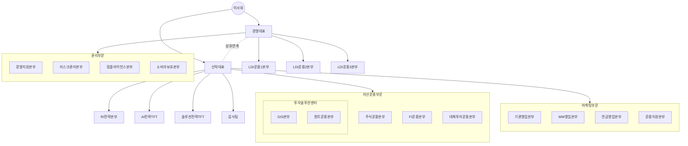

```mermaid
flowchart TD
    A((이사회))

    A --> B[경영대표]
    A --> C[신탁대표]
    B -. 상호연계 .- C

    %% -------------------- 경영대표 측 --------------------
    B --> LDI1[LDI운용1본부]
    B --> LDI2[LDI운용2본부]
    B --> LDI3[LDI운용3본부]

    subgraph MGMT[관리부문]
        direction TB
        MG1[경영지원본부]
        MG2[리스크관리본부]
        MG3[컴플라이언스본부]
        MG4[소비자보호본부]
    end
    B --> MGMT

    %% -------------------- 신탁대표 측 --------------------
    subgraph INV_DIV[자산운용부문]
        direction TB
        subgraph IS[투자솔루션센터]
            direction TB
            GIS[GIS본부]
            QNT[퀀트운용본부]
        end
        EQ[주식운용본부]
        FI[FI운용본부]
        ALT[대체투자운용본부]
    end
    C --> INV_DIV

    subgraph MKT_DIV[마케팅부문]
        direction TB
        INS[기관영업본부]
        WM[WM영업본부]
        PEN[연금영업본부]
        OPS[운용지원본부]
    end
    C --> MKT_DIV

    C --> RI[RI전략본부]
    C --> AI[AI전략TFT]
    C --> SOL[솔루션전략TFT]
    C --> AUD[감사팀]

```